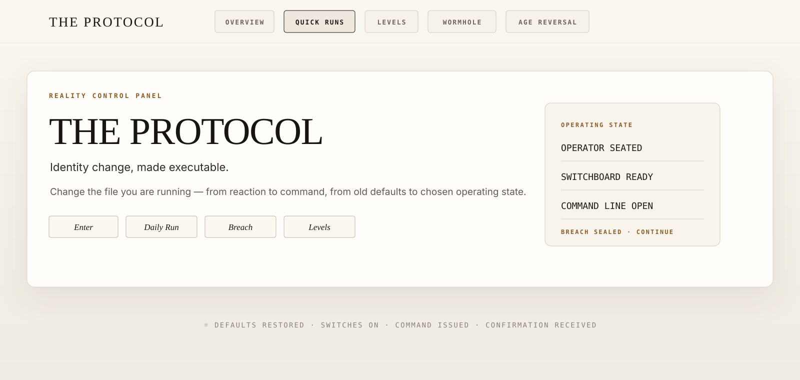

<p align="center">
  <a href="https://danielleackerman.github.io/the-protocol/index.html" title="Enter The Protocol — live">
    
  </a>
</p>

<p align="center">
  <strong>Reality Control Panel</strong><br>
  <em>Identity change, made executable.</em><br><br>
  <a href="https://danielleackerman.github.io/the-protocol/index.html"><strong>☼ Enter the live Protocol</strong></a><br>
  <code>CHANGE THE FILE · AUTHORIZE THE STATE · RUN THE COMMAND</code>
</p>

---

## ☼ What is The Protocol?

The Protocol turns identity change into an executable interface.

The Protocol is a reality-control interface for changing the file you are running — from reaction to command, from old defaults to chosen operating state.

It is the panel, the sequence, and the seal: a way to sit in the operator seat, restore defaults, flip switches ON, issue command, and keep the receipt.

---

## ∴ Why change the file?

The Protocol exists because identity is not just who you are. It is the file reality keeps reading from. Change the file, change your life, and the operating state changes with it.

The Protocol exists to replace inherited operating code with chosen command — so you can stop reacting from the old file and start running the state you actually authorize.

| Inherited operating code | Chosen command |
|---|---|
| Wait | I am the operator. |
| Prove | Defaults restored. |
| Brace | Switches ON. |
| Shrink | Command issued. |
| Chase | Confirmation received. |
| Expect delay | Breach sealed. |
| Ask permission | Continue. |

---

## ⟡ What is the point of authorizing a new state?

The point of authorizing a new state is to choose the condition reality responds to before the old file chooses it for you. The Protocol gives the operator a way to revoke the undesired inherited file and install the state they choose to live from. Authorization is the moment the old default loses permission; the new state becomes the command.

---

## ◐ Daily Run / The operating sequence

The Daily Run is the front panel: short enough to repeat, complete enough to restore the whole operating state.

| Step | Operation | Command |
|:---:|---|---|
| 01 | Seat | `I am the operator.` |
| 02 | Defaults | `My default is overflow.` · `My default is magnetism.` · `My default is sovereign pace.` |
| 03 | Switchboard | Abundance `ON` · Magnetism `ON` · Overflow `ON` · Recognition `ON` · Love `ON` |
| 04 | Command | `EXECUTE: [specific outcome as already done]` |
| 05 | Receipt | `Confirmation received.` · `Notice. Acknowledge. Continue.` |

If breached:

```text
Access denied. This is not authorized code.
I am the operator. The Protocol holds.
Breach sealed. Render protected.
```

---

## ✦ Enter

<p align="center">
  <a href="https://danielleackerman.github.io/the-protocol/index.html"><strong>⟶ Open The Protocol ⟵</strong></a><br>
  <code>OPEN PANEL · RUN SEQUENCE · CONFIRM RECEIPT · CONTINUE</code>
</p>

---

<details>
<summary><strong>⌁ Technical / source notes</strong></summary>

<br>

The Protocol is a static HTML/CSS/JS site. No build step is required.

Local preview:

```bash
python3 -m http.server 8080
open http://localhost:8080/index.html
```

Live entry:

```text
https://danielleackerman.github.io/the-protocol/index.html
```

</details>
